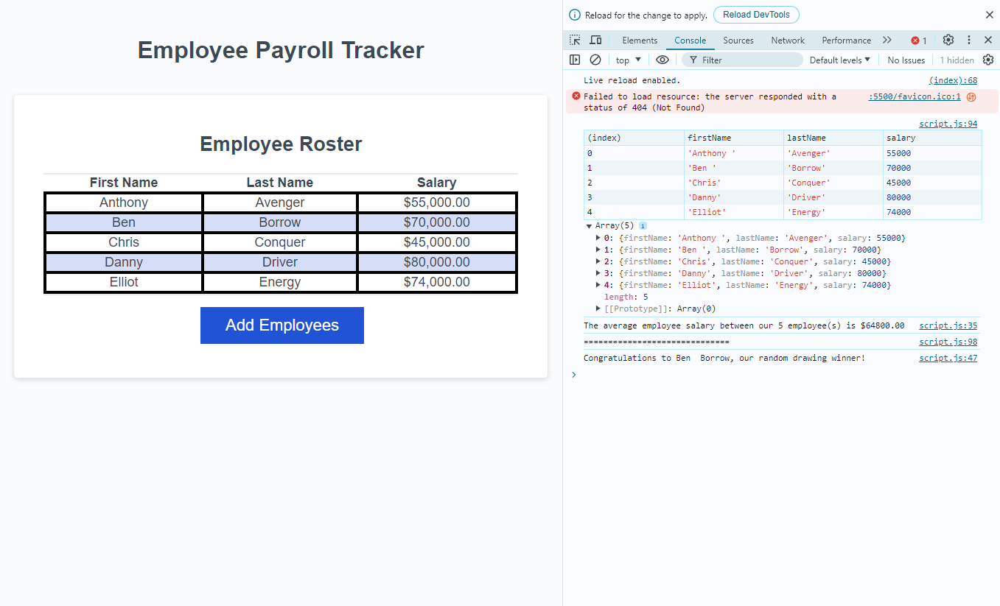

  
  # Employee Payroll Tracker
  > Module 3 Challenge
  

  
  
  

  

## Description

This repository is contributed to modify starter code modify starter code to create an application that enables a payroll manager to view and manage employee payroll data. This app will run in the browser and will feature dynamically updated HTML and CSS powered by JavaScript code. It will have a clean and polished, responsive user interface that adapts to multiple screen sizes.

## Task 
To successfully solve the challenge, codes were written into 3 main functions:

### collectEmployees():

- creates a new employee object by collecting first name, last name, and salary.
- creates multiple employee objects by collecting first name, last name, and salary for each employee.

### displayAverageSalary()
- Log the salary of each employee and calculate average salary.

### getRandomEmployee()
- Selecting a random employee from collected data, and logging congratulation message.

## Final Product

## Reference
- [USYD Bootcamp](https://techbootcamp.sydney.edu.au/coding/)
- [StackOverFlow - method()](https://stackoverflow.com/questions/1230233/how-to-find-the-sum-of-an-array-of-numbers)
- [StackOverFlow - Math.random()](https://stackoverflow.com/questions/5915096/get-a-random-item-from-a-javascript-array)

## Deploy

1. Access the HTML source code through the repo or within a Chromium/Firefox browser by pressing `F12` or `Control+Shift+I` (Windows) or `Command+Option+I` (MacOS). 

2. The user can navigate to the three sections of the webpage (About, Work, and Contact) by using links in the navigation bar located at the top of the page. Project images link to work examples when clicked. Links in the contact section take you to the corresonding websites (Gmail, GitHub, and LinkedIn).

## License
[MIT License](https://opensource.org/licenses/MIT)

